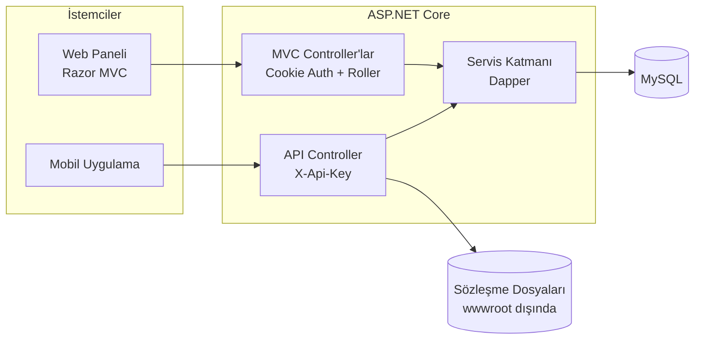

# Vinç Yönetim Paneli

Vinç ve iş makinesi kiralama firmaları için geliştirilmiş **web tabanlı yönetim paneli** ve saha operatörlerinin kullandığı **mobil uygulama için REST API**.

> **Not:** Bu proje gerçek bir müşteri için geliştirildiğinden tam kaynak kodu paylaşılmamıştır.
> Bu repo projeyi tanıtır ve mimariyi gösteren **seçilmiş örnek kodları** içerir.

> Bu proje bir **ekip çalışmasıdır**; tek kişi tarafından geliştirilmemiştir.

## Ekip
- Semih Karduz
- Şevval Uzunoğlu

---

## Ne işe yarar?

Firmanın ofis ekibi araçları, personeli ve müşteri (cari) kayıtlarını panelden yönetir. Sahadaki vinç operatörü ise işi tamamladığında mobil uygulamadan sözleşmenin fotoğrafını çekip ilgili araç ile birlikte sisteme yükler. Böylece evrak takibi kâğıttan dijitale taşınır.

## Özellikler

| Modül | Açıklama |
|---|---|
| **Kimlik doğrulama** | Cookie tabanlı oturum; Yönetici, Operatör ve Muhasebe rolleri |
| **Personel yönetimi** | Kullanıcı ekleme, güncelleme, aktif/pasif yapma |
| **Araç yönetimi** | Plakaya göre vinç/araç kaydı, mükerrer plaka kontrolü |
| **Cari hesaplar** | Vergi dairesi, vergi no ve entegrasyon numarasıyla müşteri kayıtları |
| **Sözleşmeler** | Operatörün sahadan yüklediği sözleşme görselinin araç ve operatörle eşleştirilmesi |
| **Mobil REST API** | Araç listesi, operatör listesi ve sözleşme yükleme uç noktaları (Swagger ile belgelenmiş) |

## Mimari

- **Controller → Service → Dapper → MySQL** şeklinde katmanlı yapı
- Servisler arayüzler (`ICarService`, `IUserService` …) üzerinden Dependency Injection ile verilir
- Web paneli ve mobil API aynı servis katmanını paylaşır

## Veri Modeli

| Tablo | Temel alanlar |
|---|---|
| `users` | kullanıcı adı, şifre hash'i, ad, soyad, rol, aktiflik, son giriş |
| `cars` | plaka |
| `accounts` | firma adı, vergi dairesi, vergi no, entegrasyon no |
| `agreement` | araç, operatör, cari, tutar, sözleşme görseli, durum |

## API

| Metot | Uç nokta | Açıklama |
|---|---|---|
| GET  | `/api/app/cars/getall` | Tüm araçları listeler |
| GET  | `/api/app/users/getoperators` | Aktif operatörleri listeler (şifre alanı dönmez) |
| POST | `/api/app/agreement` | Sözleşme görseli yükler (`multipart/form-data`: `CarId`, `OperatorId`, `AgreementFile`) |

Tüm API istekleri `X-Api-Key` başlığı ile doğrulanır.

## Örnek Kodlardaki Güvenlik Önlemleri

- SQL sorguları **parametreli** (SQL injection'a kapalı)
- Şifreler **PBKDF2 hash** olarak saklanır; pasif kullanıcılar giriş yapamaz
- API yanıtlarında şifre gibi hassas alanlar dönmez
- Dosya yüklemede uzantı + dosya imzası (magic bytes) kontrolü, boyut sınırı, rastgele dosya adı; dosyalar herkese açık klasörün **dışında** saklanır
- API anahtarı koda yazılmaz; ortam değişkeni / user-secrets ile verilir ve sabit zamanlı karşılaştırılır
- Hata ayrıntıları istemciye değil sunucu loguna yazılır

## Teknolojiler

- **Backend:** C#, ASP.NET Core MVC, REST API
- **Veri erişimi:** Dapper, Dapper.Contrib
- **Veritabanı:** MySQL
- **Arayüz:** Razor, Bootstrap 5, Font Awesome
- **Dokümantasyon:** Swagger (Swashbuckle)

## Örnek Kodlar

| Dosya | Ne gösterir |
|---|---|
| [`ornek-kod/Models/Entities.cs`](ornek-kod/Models/Entities.cs) | Veri modelleri ve roller |
| [`ornek-kod/Services/CarService.cs`](ornek-kod/Services/CarService.cs) | Dapper ile parametreli CRUD servisi |
| [`ornek-kod/Services/UserService.cs`](ornek-kod/Services/UserService.cs) | Hash'li şifre ile giriş doğrulama |
| [`ornek-kod/Controllers/AppController.cs`](ornek-kod/Controllers/AppController.cs) | Mobil REST API |
| [`ornek-kod/Infrastructure/AgreementStorage.cs`](ornek-kod/Infrastructure/AgreementStorage.cs) | Güvenli dosya yükleme |
| [`ornek-kod/Infrastructure/ApiKeyAttribute.cs`](ornek-kod/Infrastructure/ApiKeyAttribute.cs) | API anahtarı doğrulama filtresi |
